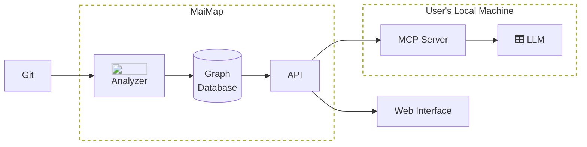

# How does it work?

MaiMap connects to your Git organization and imports your code for analysis. Once your codebases have been analyzed the resulting contextual map is stored in a graph database. This data can be accessed via a web interface and visualized in an interactive graph. An MCP server can be installed locally, to serve as a gateway between your local LLM and MaiMap's API.

## Details

#### 1. AST parsing

For each repo, the code is parsed into an abstract syntax tree (AST). The AST is then saved to a graph database. This allows MaiMap to quickly return call paths and data flows for the operations that your services perform.

#### 2. Source and Sink Analysis

Rule-based analysis is applied to the AST to identify sources and sinks in your codebase. These rules are language-specific which is why MaiMap only works for a certain set of languages.

LLM-based analysis is done by MaiMap's own internal LLM. It does further classification of AST nodes, so it can pick up where rule-based analysis may have failed to identify behaviors and patterns.

Nodes are labelled based on any sources or sinks they are identified as belonging to. Multiple nodes can have the same label.

Examples of sources and sinks that can be identified are:
- HTTP endpoints & requests
- gRPC methods & calls
- Kafka, PubSub, EventBus, RabbitMQ consumers & publishers
- Reading & writing to SQL databases
- Reading & writing to NoSQL databases

#### 3. Cross-Repo Analysis

For each repo, its sinks are compared with the sources of every other repo. If a match is identified then a connection from that service to the other is saved in the graph database. This allows us to build up a graph of connections between services.

#### 4. Results

The results of these analyses are returned in two ways:

- A web interface gives the user access to view the analyzed data. Including a visual graph of the services and their connections.
- An MCP server is used to connect your LLM to our API, which gives the LLM access to their organization's graph.
